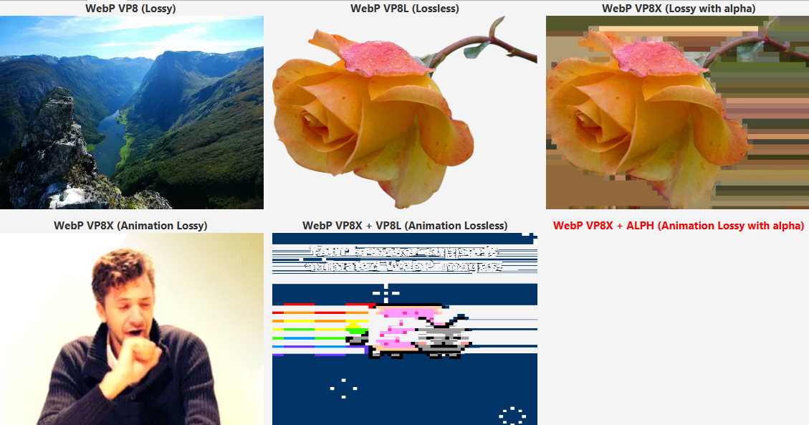

[](https://github.com/0xD3ADCODE/AetherJFX)


# AetherJFX WebP Image Decoder Plugin

> [!WARNING]  
> This plugin is designed to be used ONLY with [JavaFX](https://github.com/openjdk/jfx) fork [AetherJFX](https://github.com/0xD3ADCODE/AetherJFX). Attempting to use it with standard JavaFX will lead to an exception!

[WebP](https://developers.google.com/speed/webp) image decoding plugin for [AetherJFX](https://github.com/0xD3ADCODE/AetherJFX)

Based on [animated-webp-lib-for-java](https://github.com/Tianscar/animated-webp-lib-for-java) and integrates into JavaFX's `ImageIO` (`IIO`) instead of default one that depends on `AWT`

> [!IMPORTANT]  
> Fully supported:  
> `VP8` (Lossy)  
> `VP8L` (Lossless)  
> `VP8X` + `VP8` (Lossy Animations)    
> 
> Partially supported:  
> `VP8X` + `VP8` + `ALPH` (Lossy with separate Alpha). Alpha channel will be messy  
> `VP8X` + `VP8L` (Lossless Animations). May produce some frame artifacts  
> 
> Not supported:  
> `VP8X` + `VP8` + `ALPH` (Lossy Animations with separate Alpha)

<p align="center">
  
</p>

## Dependency

> [!WARNING]  
> Prebuild `Windows x86-64` library is included into jar. Refer to [Developers Google](https://developers.google.com/speed/webp/download) portal for installation/building guide for other systems

Define custom Gradle ivy repository in `repositories` block:
```groovy
repositories {
    //...your repositories
    def github = ivy {
        url 'https://github.com/'
        patternLayout {
            artifact '/[organisation]/[module]/releases/download/[revision]/[artifact].[ext]'
        }
        metadataSources { artifact() }
    }
    exclusiveContent {
        forRepositories(github)
        filter { includeGroup("0xD3ADCODE") }
    }
}
```

Add dependency into `dependencies` block:
```groovy
dependencies {
    //...your dependencies
    implementation("0xD3ADCODE:AetherJFX-ImageDecoder-WebP:{version}") {
        artifact {
            name = 'AetherJFX-ImageDecoder-WebP-{version}'
            type = 'jar'
        }
    }

    // JNA is required for native library
    implementation 'net.java.dev.jna:jna:5.14.0'
}
```

Replace `{version}` with latest [Release](https://github.com/0xD3ADCODE/AetherJFX-ImageDecoder-WebP/releases) tag (eg, `v1.0`)

## Usage
Register plugin as soon as possible (before JavaFX Toolkit start) with just one line of code:
```java
WebPLoader.register();
```

After that all WebP images will be decoded using newly installed decoder directly into JavaFX's `Image` without `AWT`

## Development

To properly build `jar` by yourself, clone repository and create `gradle.properties` file with:
```text
AETHER_JFX_SDK_PATH = <path to unpacked AetherJFX SDK folder>
```

## Credits
[Google](https://developers.google.com) for [WebP](https://developers.google.com/speed/webp) decoder  
[Tianscar](https://github.com/Tianscar/) for [animated-webp-lib-for-java](https://github.com/Tianscar/animated-webp-lib-for-java) WebP decoder/encoder implementation for Java